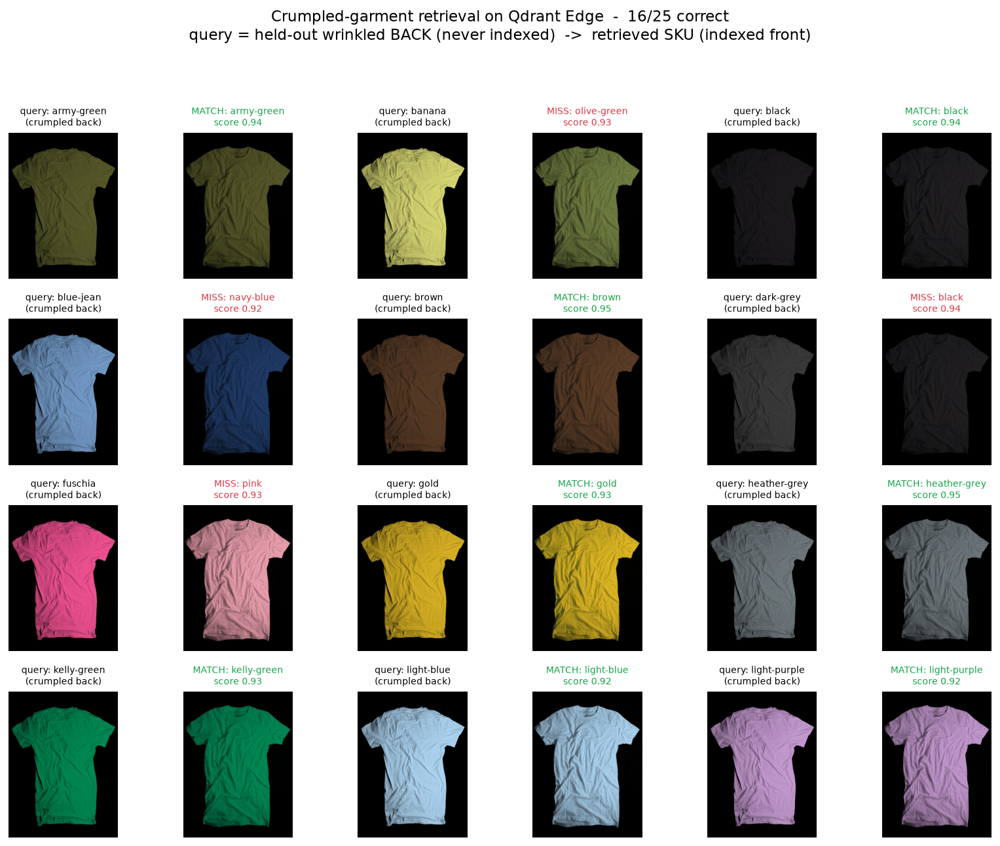

# Mixed Bin: Offline Visual Search for Apparel Robots

Recognise a crumpled garment in a mixed bin and pick it, entirely offline.

A robotic picking arm in a fashion fulfillment center cannot wait 200-500 ms for
a cloud round-trip, and the warehouse is a Faraday cage of steel shelving with
dead Wi-Fi anyway. So both the vision model and the vector search have to live
on the robot. This repo pairs an on-device Vision-Language encoder
([Apple MobileCLIP2](https://github.com/apple/ml-mobileclip)) with
[**Qdrant Edge**](https://qdrant.tech/documentation/edge/), an embedded vector
search engine that runs inside your process. No server, no network, no GPU
required to try it.

This is the engine that ships on the robot, not a stand-in for it. There is no
client mode and no server anywhere in the repo.

It accompanies the article *"Solving the Mixed Bin: Offline Visual Search for
Apparel Robotics."*

---

## The idea in one paragraph

Apparel is deformable, so a single product-shot embedding is brittle: the same
t-shirt crumpled in a tote lands far from its pristine catalog photo. We store
each SKU as **several reference views** (front, back, folded, crumpled) and let
Qdrant's multivector **MAX_SIM** late-interaction score decide the match. For
each query crop, MAX_SIM takes the best-matching stored view per SKU, so a
crumpled crop simply lights up whichever view is closest. That is the difference
between "matches the catalog photo" and "matches the item, however it is lying."

## Quickstart (no downloads, no GPU)

```bash
git clone https://github.com/rayl15/qdrant-edge-warehouse-robot.git
cd qdrant-edge-warehouse-robot
python -m venv .venv && source .venv/bin/activate
pip install -e '.[dev]'

python scripts/demo.py       # build a shard, plan picks for a simulated bin
python scripts/benchmark.py  # measure Edge search latency on your hardware
pytest                       # includes the multivector-vs-single-view test
```

Requires Python 3.10 or newer, which is what the `qdrant-edge-py` wheels target.

The demo runs on a deterministic `FakeEmbedder` so nothing is downloaded. The
pipeline code is identical to the real path, only the embedder and detector
swap.

## Run it for real (MobileCLIP2 on real images)

The repo ships a small sample catalog of real product photos under
`data/catalog/` (9 items, several views each, from Amazon Berkeley Objects, CC
BY 4.0, see `data/ATTRIBUTION.md`). `scripts/demo_real.py` indexes all views but
one per item, then queries with the held-out view to show multivector retrieval
identifies the product from a shot it never indexed:

```bash
pip install -e '.[clip]'          # torch + open_clip + transformers; weights cache once
python scripts/demo_real.py
```

Real output on the sample catalog (CPU laptop, Apple silicon):

```
Encoder ready: 512-d on cpu
Indexed 9 products as multivector points (25 catalog views).
Held-out-view retrieval (query view was NOT in the index):
  [ok ] ABO-001_amazon-merk-vinden-dames  -> ABO-001 (0.829)
  ...
Top-1 accuracy on held-out views: 9/9 = 100%
Mean search time: 0.04 ms/query (in-process, exact).
```

Note on the sample data: ABO's permissively-licensed multi-view listings are
footwear and accessories, so this catalog is shoes, bags, hats, watches and
sunglasses. Since apparel is the whole point of the article, there is a second
catalog of actual crumpled garments below.

Default encoder is `MobileCLIP2-S0` (512-d, single-digit-ms image encode, the
edge sweet spot). Override with `MIXED_BIN_MODEL`, and step up to
`MobileCLIP2-L-14` (768-d) with Orin-class headroom.

## Does it work on crumpled garments?

That is the premise of the whole thing, so here it is on real crumpled apparel.
`data/catalog_garments/` is 25 t-shirts, each photographed wrinkled from the
front and the back (Flickr user ir0cko, CC BY 2.0, see `data/ATTRIBUTION.md`).
The test is deliberately hard: index each shirt's wrinkled **front**, then query
with its wrinkled **back**, which is never in the index, and try to pick the
right shirt out of 25 near-identical tees.

```bash
pip install -e '.[clip]'
python scripts/demo_crumpled.py --panel
```



```
Indexed 25 wrinkled t-shirts as multivector points (25 reference views).
Query = each shirt's held-out wrinkled-back (never indexed).
  ...
Top-1 accuracy on held-out crumpled backs: 16/25 = 64%
Top-3 accuracy (deploy with top-k + a confidence floor): 23/25 = 92%
Mean search time: 0.13 ms/query (Qdrant Edge, in-process).
```

Two honest things to read off that. Top-3 is 92%, which is the number that
matters for a picking arm: it returns a short candidate list and a confidence
floor routes the ambiguous ones to a human (see "confidence floor" in the
article), rather than committing to a single guess. And every top-1 miss is a
near-identical shade, blue-jean landing on navy, silver on heather-grey, fuchsia
on pink. That is the single-view brittleness the article is about: one front
view is not enough to separate 25 plain tees when they differ only in wrinkle
pattern and hue.

The fix is more reference views per SKU, which is the whole reason the index is
multivector, and that is already demonstrated in this repo. The ABO demo above
(`demo_real.py`) indexes three to four views per product and gets 9/9 on
held-out shots. `tests/test_index.py` proves the same single-view-vs-multivector
case directly. The garment demo here is single-view only because the
permissively-licensed stock set gives just a front and a back per shirt, and the
back is spent as the query. Add a third real reference view per shirt (a folded
or crumpled shot) and this becomes a multivector retrieval that closes most of
the top-1 gap. That is a swap of the reference photos, not a code change: point
`data/catalog_garments/` at a catalog with more views per SKU and re-run.

## Measured search latency

`scripts/benchmark.py` builds a synthetic catalog and times warm queries, so you
can reproduce these instead of trusting them. Apple silicon laptop, 512-d
vectors, 4 views per SKU:

| Catalog | Vectors in shard | Mean | p95 | Shard build |
| --- | --- | --- | --- | --- |
| 500 SKUs | 2,000 | 0.08 ms | 0.09 ms | 0.26 s |
| 5,000 SKUs | 20,000 | 0.75 ms | 0.90 ms | 0.56 s |
| 50,000 SKUs | 200,000 | 7.26 ms | 7.99 ms | 4.6 s |

Multivector search here is exact, so latency scales linearly with catalog size
rather than flattening the way an approximate index would. That is fine, and it
is worth being clear about why. Even a 50,000-SKU catalog answers in about 7 ms,
which is 30 to 70 times faster than the cloud round-trip it replaces and still
comfortably inside a manipulation control loop. If you need a six-figure catalog
on one robot, shard it by warehouse zone, or trade exactness for an HNSW index
via `EdgeVectorParams(hnsw_config=...)`. Most picking robots only need the slice
of the catalog that is actually in their aisle.

## How it fits together

```
bin image ─▶ Detector ─▶ crop ─▶ MobileCLIP2 ─▶ vector ─▶ Qdrant Edge MAX_SIM ─▶ SKU + grip point
            (YOLO)                (VLM, on-device)         (embedded, multivector)
```

| Module | Responsibility |
| --- | --- |
| `embeddings.py` | `MobileClipEmbedder` (real) and `FakeEmbedder` (deps-free) behind one `Embedder` protocol |
| `detector.py` | Bin image to garment crops + pixel-space grip points (`SimpleBinDetector`, `YoloBinDetector`) |
| `index.py` | `EdgeShardIndex`: a Qdrant Edge shard, one multivector point per SKU |
| `catalog.py` | A folder of SKU images to multivector records |
| `search.py` | The pick loop: detect to embed to search to ranked pick plan |

## Working with the Edge shard

An Edge shard is a directory on local disk, not a service. That shapes how the
two phases split:

```python
from mixed_bin.index import EdgeShardIndex

# Back office: embed the catalog and write the shard.
with EdgeShardIndex("storage/mixed_bin", dim=512) as index:
    index.build(records)

# On the robot: open the shard that was synced down, then only ever query it.
index = EdgeShardIndex("storage/mixed_bin", dim=512)
index.load()
hits = index.search(query_vector, top_k=5)
```

Two things to know, both learned the hard way:

- Edge flushes to disk when the shard is dropped. If the directory has already
  been deleted, that flush panics from Rust. Close the shard first, which is
  what the context manager above is for.
- `EdgeShard.create` refuses to write over existing segment data and expects the
  directory to exist. `build()` handles both by clearing and recreating the path.

Because the shard is just files, updating a fleet is a file sync. Build the
shard on a back-office machine when a new season lands and push it to each
robot, so the compute-constrained board only ever queries. Edge also exposes
`snapshot_manifest` and `update_from_snapshot` if you want differential syncs
rather than shipping the whole directory.

## What is deliberately simple

- `SimpleBinDetector` tiles the image instead of detecting garments. Install the
  `detect` extra and use `YoloBinDetector` for real bounding boxes.
- `FakeEmbedder` is for tests and demos. It is not a model, it just gives stable,
  separable vectors so the retrieval wiring is provable in CI.
- Qdrant Edge is in beta, so its API may still shift. Pin `qdrant-edge-py` and
  re-check against the [docs](https://qdrant.tech/documentation/edge/) before you
  ship to a fleet.

## License

MIT. MobileCLIP2 weights are under Apple's ML Research Model license, review it
before commercial deployment.
